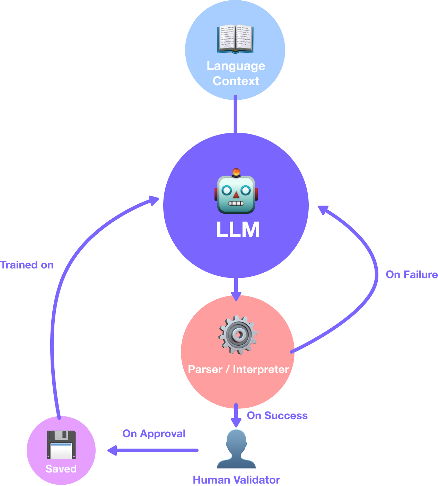

# Mojo - LangTrain
We developed LangTrain to the make it easier to teach LLMs your weird programming lanugage.  Interanaly we use a progrmaming language called LL that is propritary to us.  It is clear that no LLM like codellama or GPT4 has been trained on such a language.  That is why we built LangTrain.

### Demo Video!
[Video Link](https://drive.google.com/file/d/1UYkaULrP39rRovVX9U33FECiFlegCedY/view?usp=sharing)

## Required Dependancies
- Node
- requirements.txt

## Requied Models
```bash 
https://huggingface.co/kirp/TinyLlama-1.1B-Chat-v0.2-bin/resolve/main/tok_tl-chat.bin
```
```
https://huggingface.co/kirp/TinyLlama-1.1B-Chat-v0.2-bin/resolve/main/tl-chat.bin
```
These should be place in root (/langtrain).  They are used for inference in mojo.


# Startup
- **Make sure you install pip dependancies from requirments.txt first:** `pip install -r requirements.txt`
- Also if using conda, have that enviorment activated

Frontend:
```
mojo ctk.mojo
```

Backend:
```
mojo api_server.mojo
```

At this point you should have the backend inference server running and the front-end customertkinter interface.

## Concepts
What exactally are we trying to do here?  Here is a diagram for help understanding:
<p align="center">
    
</p>

1. The LLM has been in some way informed about the syntax & semantics of your language.  That could be through simple prompt engineering, but may be more effective and concise if taught a [EBNF](https://en.wikipedia.org/wiki/Extended_Backus%E2%80%93Naur_form) grammer (we are looking into this).
2. When the LLM generates code based on the user prompt, that code is validated by the interpreter.  This is then sent to the human in the loop for review and examination.
3. The human validator can approve code if it matched the prompt correctly, or disapprove it.
4. The saved data is used to fine-tune the LLM using LoRA or QLoRA.

# Roadmap
- [x] Local Inference
- [x] Basic Front-end
- [x] API Service
- [ ] Dockerized Service
- [ ] Support for codellama
- [ ] Fine tuning pipeline (QLoRA & LoRA)
- [ ] Improved Pipeline

# Known Bugs
- Server Crashes randomly
- console does not display interpreter logs

# Citations

Thanks to Aydyn who put together the llama.mojo that we use for inference on our server!
```
@misc{llama2.mojo,
  author = {Aydyn Tairov}, 
  title = {Inference Llama2 in one file of pure Mojo},
  year = {2023},
  month = {09},
  howpublished = {\url{https://github.com/tairov/llama2.mojo}},
  note = {Llama2 Mojo, MIT License}
}
```